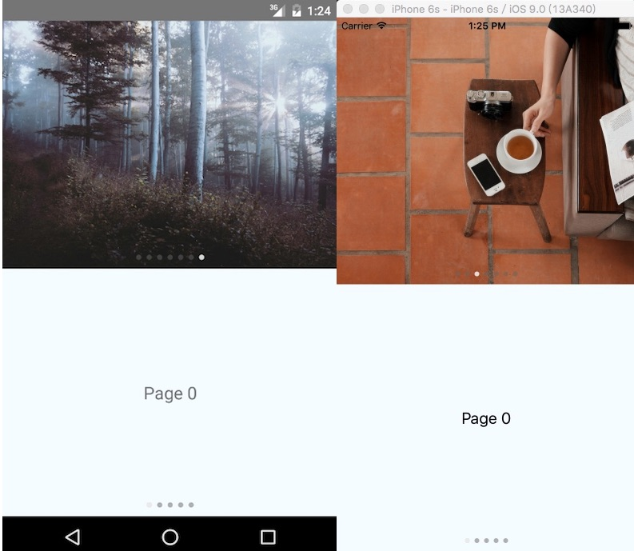

# react-native-viewpager

[](https://www.npmjs.com/package/react-native-viewpager)
[](https://www.npmjs.com/package/react-native-viewpager)


This is the `ViewPager` componnent in React Native both for Android and iOS.
This is a JavaScript-only implementation of pager for React Native. Like `ListView`,
this can render hundreds of pages without performance issue. Better than the one in
Android, this `ViewPager` can **auto play** -- turn page automaticly, **loop** -- make infinite scrolling.

## Demo



Demo project is [here](./Sample).

## Usage

1. Run `npm install react-native-viewpager --save`
2. Code like this:

```
var ViewPager = require('react-native-viewpager');
<ViewPager
    dataSource={this.state.dataSource}
    renderPage={this._renderPage}/>
```

## More configuration

* **`dataSource`**: this is require to provide pages data,
* **`renderPage`**: this is require to render page view,
* **`autoPlay`**: `true` to turn page automatically,
* **`initialPage`**: to set the index of the first page to load,
* **`isLoop`**: `true` to run in infinite scroll mode,
* **`locked`**: `true` to disable touch scroll,
* **`onChangePage`**: page change callback,
* **`renderPageIndicator`**: render custom ViewPager indicator.
* **`initialPage`**: show initially some other page than first page.

## Page Transition Animation Controls

* **`animation`**: function that returns a React Native Animated configuration.

Example:
```
var ViewPager = require('react-native-viewpager');
<ViewPager
    dataSource={this.state.dataSource}
    renderPage={this._renderPage}
    animation = {(animatedValue, toValue, gestureState) => {
    // Use the horizontal velocity of the swipe gesture
    // to affect the length of the transition so the faster you swipe
    // the faster the pages will transition
    var velocity = Math.abs(gestureState.vx);
    var baseDuration = 300;
    var duration = (velocity > 1) ? 1/velocity * baseDuration : baseDuration;

    return Animated.timing(animatedValue,
    {
      toValue: toValue,
      duration: duration,
      easing: Easing.out(Easing.exp)
    });
  }}
/>
```

## Licensed

MIT License
